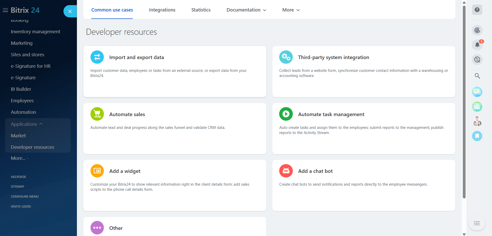
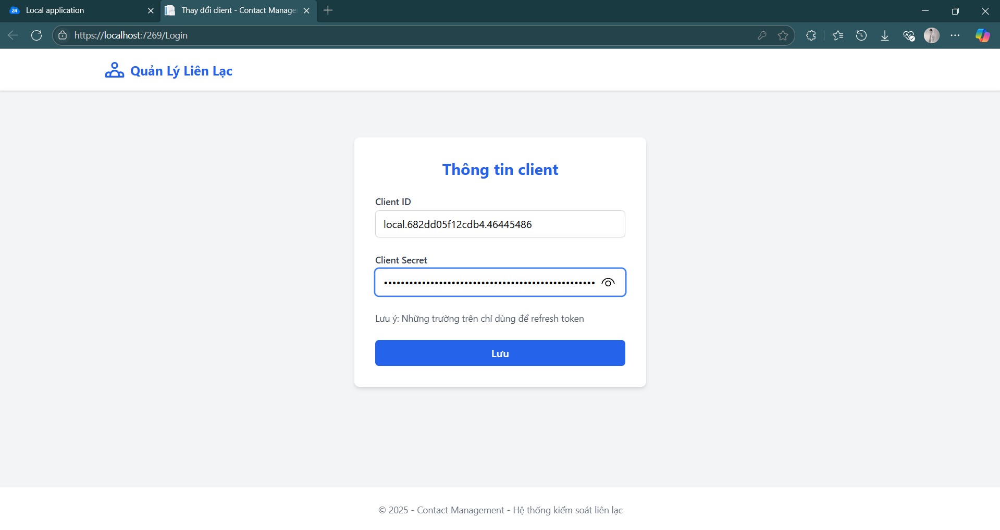
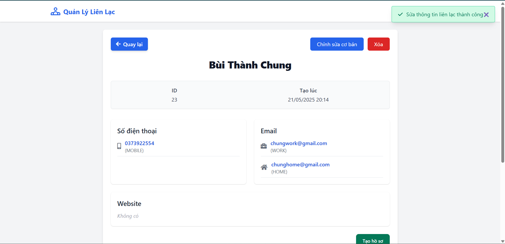
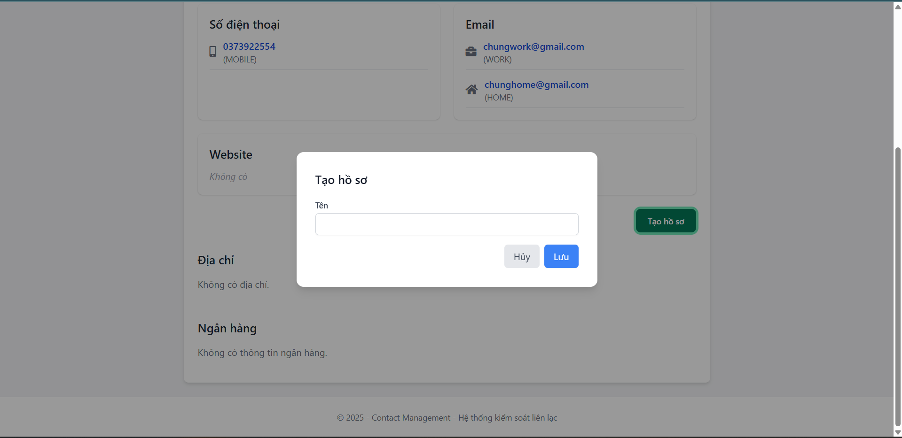

# Project Tích hợp Bitrix24

Dự án này minh họa việc tích hợp với Bitrix24 sử dụng .NET 8, với các tính năng quản lý liên hệ và thiết lập ứng dụng.

---

## Yêu cầu

Trước khi bắt đầu, hãy đảm bảo bạn đã cài đặt các công cụ sau:

* **Visual Studio 2022**
* **Ngrok**
* **.NET 8 SDK**

Bạn cũng sẽ cần 2 cổng trống: `5010` và `7269`.

---

## Cài đặt

Thực hiện theo các bước sau để thiết lập và chạy dự án:

1.  **Clone project** về máy, sau đó vào thư mục và chạy file `Bitrix24Integration.sln`.
2.  Trong Visual Studio, chọn **Project** -> **Configure Startup Projects...**

    

3.  Chọn **Multiple startup projects** và bật **Action** -> **Start** cho cả hai project. Nhấn **OK**.

    

4.  **Chạy project** (F5 hoặc nút Start).
5.  **Bật Ngrok** bằng cách mở terminal hoặc command prompt và chạy lệnh sau:

    ```bash
    ngrok http 5010
    ```

    

6.  Truy cập trang Bitrix24 cá nhân của bạn, sau đó chọn **Developer resources**.

    

7.  Chọn **other** -> **local application**.

    

8.  Copy link từ Ngrok (ví dụ: `https://your-ngrok-url.ngrok-free.app`) và điền vào trường **Install path** với `/api/Install` ở cuối. Sau đó, nhấn **Save**.

    

    

---

## Hướng dẫn sử dụng

Dự án này bao gồm hai bài tập chính: tương tác với Bitrix24 API qua Swagger và quản lý liên hệ thông qua giao diện web.

### Bài 1: Sử dụng Bitrix24 API qua Swagger

1.  Truy cập trang Swagger UI tại `https://localhost:7289/swagger`.

    

2.  Tìm và mở rộng API **CallApi**. Nhấn **Try It Out**.

    

3.  Quay lại trang ứng dụng local Bitrix24 để lấy **Application ID (Client ID)** và **Application Key (Client Secret)**. Điền thông tin này vào các trường tương ứng trong Swagger.

    

    

4.  Nhấn **Execute**. Kéo xuống để xem kết quả API.

    

---

### Bài 2: Quản lý liên hệ qua giao diện web

1.  Truy cập trang quản lý liên hệ tại `https://localhost:7269/`.

    

2.  Điền **Application ID (Client ID)** và **Application Key (Client Secret)** từ Bitrix24 của bạn, sau đó nhấn **Lưu**.

    

3.  Trên trang chính, bạn có thể thực hiện các hành động: **xóa** (biểu tượng thùng rác), **tìm kiếm**, hoặc xem **chi tiết liên hệ** (biểu tượng bên cạnh thùng rác).

    

4.  Để tạo một liên hệ mới, nhấn **Thêm Liên Hệ** từ trang chính.

    

5.  Điền vào các trường thông tin liên hệ và nhấn **Tạo**.

    

    

6.  Nếu thành công, bạn sẽ tự động được dẫn đến trang chi tiết của liên hệ đó.

    

7.  Tại đây, bạn có thể **chỉnh sửa thông tin cơ bản** như Tên, Email, Số điện thoại và Website.

    

     -> 

8.  Kéo xuống dưới là phần thông tin **Bank** và **Address**. Trước tiên, bạn phải tạo một hồ sơ để thêm thông tin này.

     ->  -> 

9.  Từ đó, bạn có thể **thêm/xóa/sửa** các thông tin Bank hoặc Address, hoặc **xóa toàn bộ hồ sơ** (lưu ý: thao tác này cũng sẽ xóa luôn thông tin Bank và Address kèm theo).

     -> 

     ->  -> 

10. **Lưu ý quan trọng:** Nếu có thông báo lỗi, thường là do thiếu **Application ID (Client ID)** và **Application Key (Client Secret)**. Nhấn vào nút **Thay đổi Credentials** để cập nhật chúng.